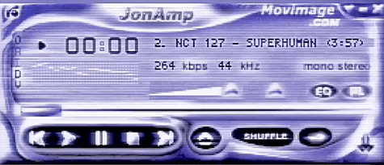
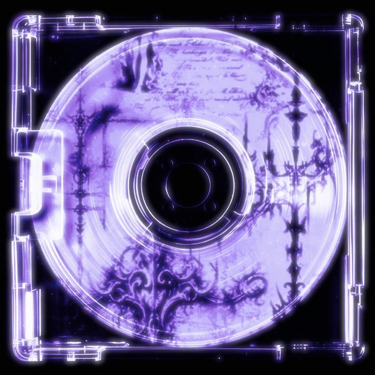

  
  
  

<h3 align="center">Know About Me?</h3>

Hey there! I'm Marcelo 
I am a Software Developer passionate about technology, programming and creating complete systems. I enjoy combining logic, creativity and visual design to create modern and functional applications.
Currently, I am focused on improving my skills, learning new technologies and developing projects that allow me to grow as a developer.

 

<h3 align="center">Top Projects</h3>

  

<h3 align="center">Tech Stack</h3>

  
  
  

<h3 align="center">Contact</h3>

  

<h3 align="center">GitHub Stats</h3>

  

  

  

<blockquote>

  Code is never finished. It only becomes slightly less terrible over time.

</blockquote>
